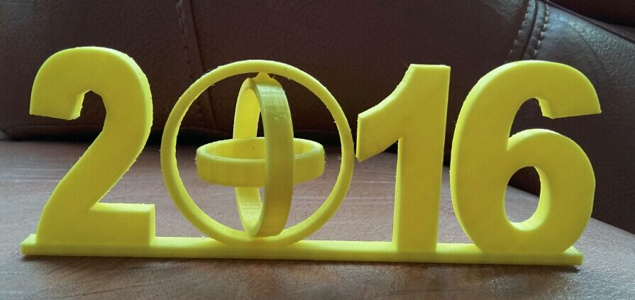
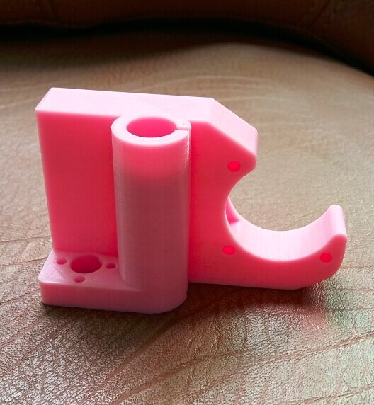
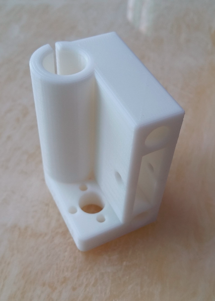
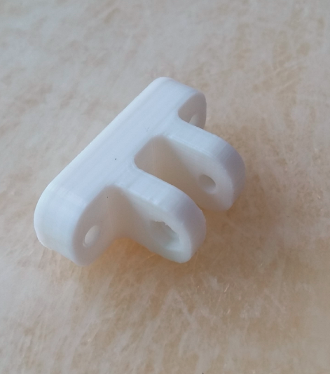
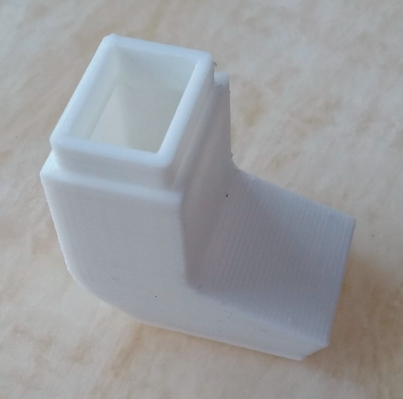

# ALUNAR M508 3D Printer — Instructions & Resources (v2.0)

Official instructions, firmware, software and test files for the **ALUNAR M508** (Prusa i3-style) 3D printer. Version 2.0, released September 2016.


---

## Table of Contents

- [Repository Structure](#repository-structure)
- [Installation Instruction](#installation-instruction)
- [Firmware](#firmware)
- [Software](#software)
- [Test Files](#test-files)
- [Common Problems](#common-problems)
- [Packing List](#packing-list)

---

## Repository Structure

```
├── Installation Instruction/
│   ├── ALUNAR M508 Quick Start Guide_(V2.0).pdf
│   └── Video/
│       ├── 1-Frame assembly.mp4
│       ├── 2-Y-Axis And Hot bed Assembly.mp4
│       ├── 3-Z-X-Axis Assembly.mp4
│       ├── 4-Extruder Assembly.mp4
│       ├── 5-LCD-Assembly.mp4
│       ├── 6-Power And Main board Assembly.mp4
│       ├── 7-Filament Rack Assembly.mp4
│       ├── Open Carton.mp4
│       ├── Power On Inspection.mp4
│       ├── Hot Bed Leveling.mp4
│       ├── LCD Feature And Printing From SD Card.mp4
│       ├── Change Filament When Printing.mp4
│       ├── Manually Change Filament.mp4
│       ├── Test Print.mp4
│       └── finish picture/
├── Firmware/
│   ├── Main_I3/          ← Marlin firmware source code
│   ├── arduino-1.5.4.rar ← Arduino IDE required to flash
│   └── How to download the firmware.pdf
├── Software/
│   ├── RepetierHost_1_0_6/
│   └── Slicing software/
├── TestFile/
│   ├── STLMode/          ← 3D models (.stl)
│   └── TestMode/         ← Ready-to-print G-code files
├── Common problem/
└── Packing list/
```

---

## Installation Instruction

The [`Installation Instruction/`](Installation%20Instruction/) folder contains the full quick start guide and a complete set of assembly videos.

### Quick Start Guide

[ALUNAR M508 Quick Start Guide (V2.0).pdf](Installation%20Instruction/ALUNAR%20M508%20Quick%20Start%20Guide_%28V2.0%29.pdf)

### Assembly Videos

Follow the videos in order for a complete build:

| Step | Video |
|------|-------|
| 1 | [Open Carton](Installation%20Instruction/Video/Open%20Carton.mp4) |
| 2 | [Frame Assembly](Installation%20Instruction/Video/1-Frame%20assembly.mp4) |
| 3 | [Y-Axis & Hot Bed Assembly](Installation%20Instruction/Video/2-Y-Axis%20And%20Hot%20bed%20Assembly.mp4) |
| 4 | [Z & X Axis Assembly](Installation%20Instruction/Video/3-Z-X-Axis%20Assembly.mp4) |
| 5 | [Extruder Assembly](Installation%20Instruction/Video/4-Extruder%20Assembly.mp4) |
| 6 | [LCD Assembly](Installation%20Instruction/Video/5-LCD-Assembly.mp4) |
| 7 | [Power & Main Board Assembly](Installation%20Instruction/Video/6-Power%20And%20Main%20board%20Assembly.mp4) |
| 8 | [Filament Rack Assembly](Installation%20Instruction/Video/7-Filament%20Rack%20Assembly.mp4) |

### Operation Videos

| Topic | Video |
|-------|-------|
| Power On Inspection | [Power On Inspection.mp4](Installation%20Instruction/Video/Power%20On%20Inspection.mp4) |
| Hot Bed Leveling | [Hot Bed Leveling.mp4](Installation%20Instruction/Video/Hot%20Bed%20Leveling.mp4) |
| LCD Features & SD Card Printing | [LCD Feature And Printing From SD Card.mp4](Installation%20Instruction/Video/LCD%20Feature%20And%20Printing%20From%20SD%20Card.mp4) |
| Change Filament While Printing | [Change Filament When Printing.mp4](Installation%20Instruction/Video/Change%20Filament%20When%20Printing.mp4) |
| Manual Filament Change | [Manually Change Filament.mp4](Installation%20Instruction/Video/Manually%20Change%20Filament.mp4) |
| Test Print | [Test Print.mp4](Installation%20Instruction/Video/Test%20Print.mp4) |

> **Note:** Large video files are stored with Git LFS. Make sure you have `git-lfs` installed before cloning: `sudo apt-get install git-lfs && git lfs install`.

---

## Firmware

The [`Firmware/`](Firmware/) folder contains the Marlin-based firmware source for the M508.

- **Source code:** [`Firmware/Main_I3/`](Firmware/Main_I3/) — Arduino sketch (`.ino`) and all associated `.cpp`/`.h` files.
- **Arduino IDE:** [`Firmware/arduino-1.5.4.rar`](Firmware/arduino-1.5.4.rar) — Required version to compile and flash.
- **Flashing guide:** [`Firmware/How to download the firmware.pdf`](Firmware/How%20to%20download%20the%20firmware.pdf)

### Key firmware files

| File | Description |
|------|-------------|
| `Main_I3/Main_I3.ino` | Main sketch entry point |
| `Main_I3/Configuration.h` | Primary machine configuration (steps/mm, temperatures, etc.) |
| `Main_I3/Configuration_adv.h` | Advanced configuration options |
| `Main_I3/Marlin_main.cpp` | Core Marlin logic |
| `Main_I3/temperature.cpp/h` | Temperature control (hotend & bed) |
| `Main_I3/stepper.cpp/h` | Stepper motor driver |
| `Main_I3/planner.cpp/h` | Motion planning |
| `Main_I3/motion_control.cpp/h` | Arc/straight-line motion |
| `Main_I3/ultralcd.cpp/h` | LCD menu system |
| `Main_I3/cardreader.cpp/h` | SD card support |

### Flashing the firmware

1. Extract `arduino-1.5.4.rar` and install Arduino IDE 1.5.4.
2. Open `Firmware/Main_I3/Main_I3.ino`.
3. Select board: **Arduino Mega 2560**.
4. Connect the printer via USB and upload.

Refer to [`How to download the firmware.pdf`](Firmware/How%20to%20download%20the%20firmware.pdf) for detailed steps with screenshots.

---

## Software

The [`Software/`](Software/) folder contains the tools needed to control the printer and prepare print files.

### Repetier-Host v1.0.6

[`Software/RepetierHost_1_0_6/`](Software/RepetierHost_1_0_6/) — Host software for sending G-code to the printer over USB.

Download from: http://www.repetier.com/

**Setup:**
1. Install the USB serial driver before connecting the printer.
2. Open Repetier-Host and set the correct COM port and baud rate (see [`Baud rate setting.jpg`](Software/RepetierHost_1_0_6/Baud%20rate%20setting.jpg)).
3. Adjust print range settings as shown in [`Print range settings.jpg`](Software/RepetierHost_1_0_6/Print%20range%20settings.jpg).

### Slicing Software — Cura 15.04

[`Software/Slicing software/`](Software/Slicing%20software/) — Converts `.stl` models into `.gcode` files ready to print.

- **Guide:** [`How to use Cura 15.04.pdf`](Software/Slicing%20software/How%20to%20use%20Cura%2015.04.pdf)
- **M508 PLA profile:** [`M508－PLA.ini`](Software/Slicing%20software/M508%EF%BC%8DPLA.ini) — Import this profile in Cura for optimised M508 PLA settings.

---

## Test Files

The [`TestFile/`](TestFile/) folder contains sample models and pre-sliced G-code files to verify the printer is working correctly.

### Ready-to-print G-code (`TestFile/TestMode/`)

| File | Preview |
|------|---------|
| `test.gcode` |  |
| `man.gcode` |  |
| `Pigalle.gcode` |  |
| `2016.gcode` |  |
| `Z-left.gcode` |  |
| `Z-right.gcode` |  |
| `YZ.gcode` |  |
| `FZ-.gcode` |  |
| `test-Pencil_holder.gcode` |  |

### 3D Models (`TestFile/STLMode/`)

| File |
|------|
| `2016.stl` |
| `Pencil_holder.stl` |
| `Pigalle.stl` |
| `FZ-.STL` |
| `YZ.STL` |
| `Z-left.STL` |
| `Z-right.STL` |

---

## Common Problems

The [`Common problem/`](Common%20problem/) folder contains troubleshooting guides:

| Guide | Description |
|-------|-------------|
| [`"Err MINTEMP" Trouble.pdf`](<Common%20problem/%E2%80%9CErr%20%20MINTEMP%20%E2%80%9DTrouble.pdf>) | How to resolve the MINTEMP thermistor error |
| [`LCD Common problem.pdf`](Common%20problem/LCD%20Common%20problem.pdf) | Common LCD display issues and fixes |
| [`Print Quality Troubleshooting Guide.pdf`](Common%20problem/Print%20Quality%20Troubleshooting%20Guide.pdf) | Diagnosing and fixing print quality problems |

---

## Packing List

The [`Packing list/`](Packing%20list/) folder contains the full list of parts included in the M508 kit.

- [`M508 Packing list.pdf`](Packing%20list/M508%20Packing%20list.pdf)
- [`Packing list-M508.pdf`](Packing%20list/Packing%20list-M508.pdf)
- [`Open the carton.jpg`](Packing%20list/Open%20the%20carton.jpg)

---

## Cloning this repository

This repository uses **Git LFS** for large binary files (videos, G-code, STL, RAR). Install Git LFS before cloning:

```bash
sudo apt-get install git-lfs
git lfs install
git clone https://github.com/Nefreyu/Alunar-M508-3D-Printer.git
```
